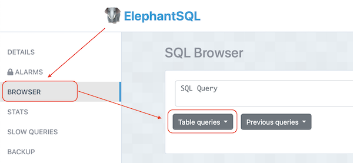
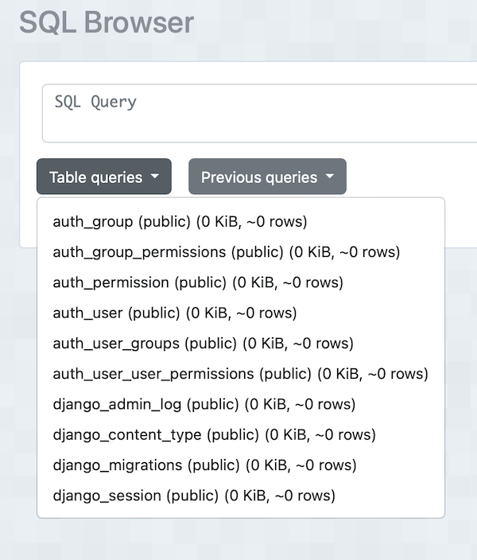
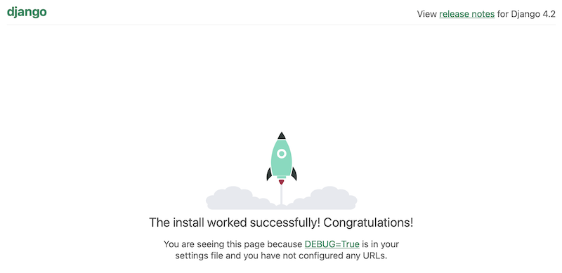
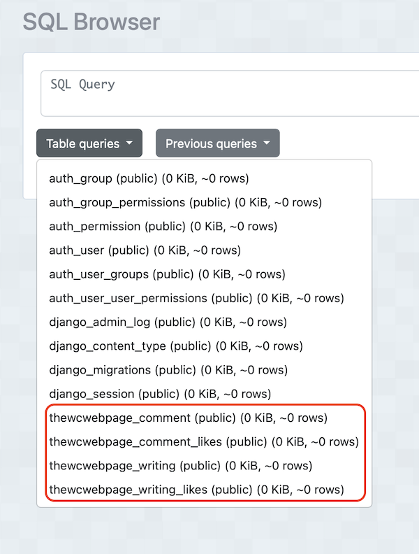
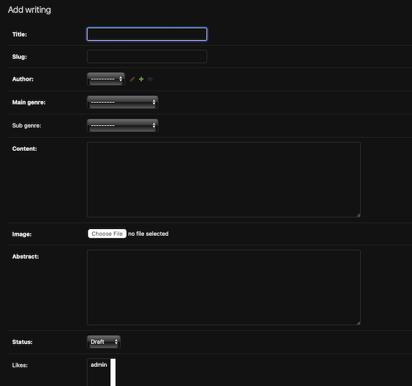
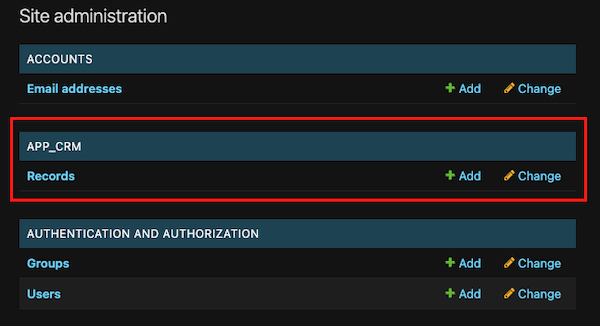
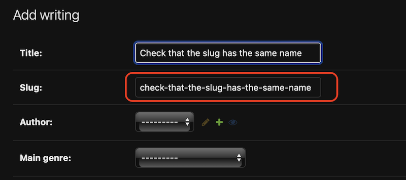

# The WC (Writers Club) Webpage

## The idea behind the webpage

 The Writers Club, or WC, is where writers can share their work and get feedback from other writers. It is a place where writers can find inspiration, and where they can find other writers to collaborate with.

 Why WC... this is simple, an idea is something that intoxicates you until to push it out of your body, OK, brain, so the WC is the place where you can do that. But, ideas are not always complete. Sometimes, we, writers, start evrything with a punch-line, or and ending, or even a middle. So, the WC is the place where you can find the missing pieces of your ideas, and where you can help others to find the missing pieces of their ideas.

 But, the WC is not only for writers, it is also for readers. It is a place where readers can find new stories to read, and where they can find new writers to follow.

 And, even better, it is also for photographers.

 Do you think that your photo deserves to be expanded with a written story? Do you think that your photo can inspire a writer to write a story? Then, the WC is the place for you. Upload your photo, with or without an initial story, and let the writers do the rest.

## How does it work

If you are a reader, just navigate through it, and enjoy the stories and photos. You can even follow the development of them, as other creators write new chapters, or add new photos.

If you are a writer, you can create a new story, or you can continue an existing one. You can also add a new chapter to an existing story. And, if you are a photographer, you can upload your photos, and let the writers do the rest.

## How to collaborate and rules

1. An author starts a story or postes and image as a kick-off for a story.
    * The author will give the Story a Title wich can be changed at any point, even at the end of the project.
    * The Author must give a Main Genre to set the mood that she/he is looking for.
    * The Author can set a Sub Genre to give freedom of writing to her/his collaborators.
    * The Author must give an Abstract of what she/he thinks would lead the story. It should be comprehensive enough to set the tone and the mood of the story.
    * The Author can add an image to the story. This image will be used as the cover of the story. (Optional)
    * The Author must give a deadline for entries.

2. Any user with a registered account and access to the story (future feature) can add a comment to the story.
    * The comment can be a normal comment, or a proposal of story continuity (chosen from the *"type"* field).

3. After the deadline is due, The Author will choose up to 3 writings and publish them indicating her/his preferred one. This Writing will immediately have a 10% weight more than the others.

4. All users can vote by liking the writings (and can vote for the three of them if they want) for their preferred writing. The voting will be open for 1 week.

5. After the voting period is over, the writing with the most votes (including that 10% weight from the Authors chosen one) will be chosen as the next chapter of the story.

6. The process will be repeated until the writer decides to end the story, or until the story is not voted for 3 times in a row.

*NOTE:* on every iteration, the Author will decide if she/he would like to add a new chapter to the story, or if she/he would like to end the story.

## Project setup

### Install dependencies

First, it is needed to create a virtual environment, which is a folder that contains a Python installation and all the packages needed for the project. This is done by running the following command at the root of the project:

```Python
python3 -m venv .venv
```

**NOTE**: The name of the virtual environment folder is .venv, which is the default name. If you want to use a different name, you should add the name of the folder to the .gitignore file. Also, ```python3``` was used because the project was developed on a Mac. If you are using Windows, you should use ```python``` instead.

Then, the virtual environment is activated by running the following command:

```Python
source .venv/bin/activate
```

Finally, the dependencies are installed by running the following command:

```Python
pip3 install django gunicorn dj_database_url dj3-cloudinary-storage urllib3 psycopg2 django-summernote django-allauth django-crispy-forms
```

**Django**, is the main framework used to create the application. It allows the developer to create a web app using Python.
**Gunicorn** is a web server that is used to deploy the application to Heroku. dj_database_url is a package that allows the developer to connect to a database. **dj3-cloudinary-storage** is a package that allows the developer to connect to Cloudinary, which is a cloud-based image and video management service.
**urllib3** is a package that allows the developer to make HTTP requests.
**psycopg2** is a package that allows the developer to connect to a PostgreSQL database.
**django-summernote** is a package that allows the developer to add a rich text editor to the application.

### Create the environment variables

First, create a env.py file in the root of the project with the following variables:

```Python
import os   # for os.environ.get

# Set the environment variables
os.environ["DATABASE_URL"]='YOUR_DB_URL'
os.environ["SECRET_KEY"]='YOUR_SCRET_KEY!'
# If you will work with images or static files, you will need to set the following variable
os.environ["CLOUDINARY_URL"]="YOUR_CLOUDINARY_URL"
```

**NOTE:** The env.py file is not pushed to GitHub because it contains sensitive information. Therefore, if you want to run the project locally, you need to create your own env.py file.

Then, add the env.py file to the .gitignore file, so it is not pushed to GitHub.

### Create a Django project

**NOTE:** Please, be aware that one thing is the project and another thing is the application. The project is the whole thing, while the application is a part of the project. In this case, the project is called *ci-fsd-blog* and the application is called *blog*.

A Django project is created by running the following command:

```shell
django-admin startproject ci_fsd_pp4_the_wc .
# The dot at the end is important because it tells Django to create the project in the current directory.
```

But, Django also needs to know where to get the variables from, therefore, the following lines are added to the settings.py file:

```Python
import os
import dj_database_url

if os.path.isfile("env.py"):
    import env
```
Change the database settings to the following:

```Python
DATABASES = {
    'default': dj_database_url.parse(os.environ.get("DATABASE_URL"))
    }
```

And the secret key that comes by default should be changed to:

```Python
SECRET_KEY = os.environ.get("SECRET_KEY")
```

To be able to see the webpage, the ALLOWED_HOSTS list should be changed to:

```Python
ALLOWED_HOSTS = ['localhost', '127.0.0.1','thewcwebpage-83a6428384c3.herokuapp.com']
```

The ones declared as local host correspond to the ones used during the development process, while the one declared as thewcwebpage-83a6428384c3.herokuapp.com is the one used by Heroku.

An app's name should follow [Pep 8 Guidelines](https://www.python.org/dev/peps/pep-0008/#package-and-module-names), namely it should be short, all-lowercase and not include numbers, dashes, periods, spaces, or special characters. It also, in general, should be the plural of an app's main model, so our posts app would have a main model called Post.

A Django application is created by running the following command:

```shell
python3 manage.py startapp thewcwebpage
```

Then, the application is added to the project by adding the following line to the INSTALLED_APPS list in the settings.py file:

```Python
'thewcwebpage',
```

Create the static and templates folders in the root folder by running the following commands:

```shell
mkdir static
mkdir templates
```

To create the templates for the registration and login pages, the following command is run:
(All these will be used later, but it is better to have everything ready.)

```shell
cp -r ./.venv/lib/python3.11/site-packages/allauth/templates/* ./templates
```

This will copy all the templates from the allauth package to the templates folder.


### DB Configuration

Remember that you already installed dj_database_url, which is a package that allows the developer to connect to a database. Also, you have already declare your environment variable for the database in the env.py file.

Therefore, you need to add the following lines to the settings.py file:

```Python
DATABASES = {
    'default': dj_database_url.parse(os.environ.get("DATABASE_URL"))
    }
```
### Migrations

Everytime a change is made to the models (db structure), it is needed to run the following commands:

```shell
python3 manage.py makemigrations
python3 manage.py migrate
```
...and as we created all necessary setup to be able to run a DB in the project, we need to run the commands above.

At this point, you should be able to see some tables in the DB.

We are using Elephant SQL as our DB provider, and we are using the free tier, which is limited to 20MB. Therefore, we need to be careful with the amount of data we store in the DB.

And the tables can be accessed here:



and can be queried here:



### Create a superuser

To be able to access the admin panel, it is needed to create a superuser by running the following command:

```shell
python3 manage.py createsuperuser
```

You will be asked for your username, email and password. This will be the user that will be able to access the admin panel.

### Testing the app

To test the app, it is needed to run the following command:

```shell
python3 manage.py runserver
```

Open the local address in your web browser, and you should be able to see the webpage.




### Initial deployment to Heroku

As the project will be deployed in Heroku, after installing the dependencies, it is needed to create a requirements.txt file by running the following command:

```shell
pip3 freeze > requirements.txt
```

This file will contain all the dependencies installed in the project, and will be used by Heroku to install them when the project is deployed.

Now, it is needed to create a Procfile, which is a file that tells Heroku what to do when the project is deployed. This is done by running the following command:

```Shell
echo web: gunicorn django_crm.wsgi:application > Procfile
```

### Add the app file to your urls definition

To be able to access the app, it is needed to add the app file to the urls definition in the urls.py file. For this, the project urls.py file is modified by adding the following line (and importing include):

```Python
from django.contrib import admin
from django.urls import path, include  # include added for thewcwebpage app

urlpatterns = [
    path('admin/', admin.site.urls),
    path('', include('thewcwebpage.urls')),
]
```

### Create the app urls

But it is the app actually, the one accessing urls. Therefore, it is needed to create the app urls by creating a urls.py file in the app folder and adding the following lines:

```Python
from django.urls import path
from . import views

urlpatterns = [
    path('', views.home, name='home'),
]
```

### Create the models (DB structure)

The DB should have tables for the following models:

* **USER:** where all data of each registered user is stored.

* **WRITING:** where all data of each story is stored.

| key          | Name          | Type             |
|--------------|---------------|------------------|
|              | Title         | Char[200]        |
| FK           | Author        | UserModel        |
|              | Main_Genre    | Char[20]         |
|              | Sub_Genre     | Char[20]         |
|              | Created On    | DateTime         |
|              | Updated On    | DateTime         |
|              | Content       | TextField        |
|              | Image         | Cloudinary Image |
|              | Abstract      | TextField        |
| Many to Many | Likes         | User Model       |
|              | Slug (unique) | SlugField        |
|              | Status        | Integer          |

The following GENRES are available:

- Action and Adventure
- Comedy
- Crime and Mistery
- Fantasy
- Horror
- SciFi
- Romance
- Poetry
- Other

<br>

* **COMMENT:** Comments in the WC are treated either as normal comments or as further writing of an original story. Therefore, the comment model should have a field to indicate if it is a normal comment or a proposal of story continuity.

| Key | Name             | Type         |
|-----|------------------|--------------|
| FK  | Writing          | WritingModel |
| FK  | Author           | UserModel    |
|     | Created On       | DateTime     |
|     | Updated On       | DateTime     |
|     | Content          | TextField    |
|     | Status           | Integer      |
|     | Writing Type     | Integer      |
|     | Likes            | UserModel    |
|     | Approved Comment | Boolean      |

The models are created in the models.py file. In this case, the models are:

But, the tables are not yet accessible in the admin panel. To do so, and as we have already created a superuser in the previous steps, it is needed to register the models in the admin.py file by adding the following lines:

```Python
from .models import Writing, Comment

admin.site.register(Writing)
admin.site.register(Comment)
```

Django will automatically pluralize the name of the model, so it will be Writings and Comments in the admin panel.


And, will create the tables in the database.



And, now, you will be able to create new writings in the admin panel.



Then, it is needed to register the model in the admin.py file by adding the following lines:

```Python
from .models import writing
```

Django will automatically pluralize the name of the model, so it will be writings in the admin panel.



And, will create the table in the database.


### Create new writings for the normal user

Until now, only users with access to the admin panel can create the new writings, but this is not what we want. We want that any user can create a new writing, and that the writing is associated to the user that created it.

For this, we need to install Summernotes, which is a package that allows the developer to add a rich text editor to the application. This is done by running the following command:

```shell
pip3 install django-summernote
```

Then, it is needed to add the following lines to the INSTALLED_APPS list in the settings.py file:

```Python
'django_summernote',
```

Then, it is needed to add the following lines to the urls.py file:

```Python
path('summernote/', include('django_summernote.urls')),
```

Then, it is needed to add the following lines to the admin.py file, to tell the panel which fields to use the rich text editor:

```Python
from django_summernote.admin import SummernoteModelAdmin

@admin.register(Writing)
class WritingAdmin(SummernoteModelAdmin):
    summernote_fields = ('content',)
    list_display = ('title', 'slug', 'author', 'created_on', 'updated_on', 'main_genre', 'sub_genre', 'status', 'total_likes')

@admin.register(Comment)
class CommentAdmin(SummernoteModelAdmin):
    summernote_fields = ('content',)
    list_display = ('writing', 'author', 'created_on', 'updated_on', 'status', 'writing_type', 'total_likes')
```

*NOTE:* we are using python decorators now to register the models in the admin panel. This is the same as doing (that we did before, so it should be deleted):

```Python
admin.site.register(Writing, WritingAdmin)
```

Now, the writings and comments have a proper text editor:


To see the full definition of the models, please refer to the code (admin.py and models.py files).

### Slug summernote_fields

The slug is a field that is used to create a unique URL for each writing. It is created automatically by Django, but it is not very user friendly. Therefore, it is needed to create a slug field in the model, and to create a slug for each writing.

This is done by adding the following lines to the admind.py file for each class that would need a slug:

```Python
prepopulated_fields = {'slug': ('title',)}
```

In this case, the slug is created using the title of the writing.




## The design of the webpage and app

For most of the styling, Bootstrap was used, and some customization was done in the style.css file.

To create the pages (html files), we need first to create a templates folder in the root of the app folder. Inside of this folder we will create all the html files.

We have already created the models but, as Django is a Model-View-Template framework, that means, that everytime that we would like to create a page or module, we would need to cover three steps:

1. Create the view
2. Create the template to render the view
3. Connect up our URLs in the urls.py file


### The views

The views are created in the views.py file, and they are the ones that will render the html files.

The views are created by adding the following lines to the views.py file:

```Python
from django.shortcuts import render

def home(request):
    """ A view to return the reqeusted page """

    return render(request, 'requested_page.html')
```

Please, refer to the code for the full definition of the views.

### The base template

The base template is the template that is used by all the other html pages. It contains the header, the footer and the navbar. It also contains the links to the Bootstrap and jQuery libraries.

But, as it can be seen, the header is a nav bar, therefore, it was created sepparately in the navbar.html file, and then it was included in the base.html file by adding the following line:

```HTML

```

### The navbar

The navbar is a Bootstrap navbar, and it is created in the navbar.html file. It contains the links to the different pages of the app, and it also contains the links to the login and registration pages.

### The home page

The home page is the page that is shown when the user first enters the webpage. It contains a carousel with some images, and it also contains a section with some information about the company.

For the login process, no new webpage was created. Instead, it was included in the home screen as a modal. This was done by adding the following lines to the home.html file:

```HTML

```

For the logout, a new webpage was created, and it was added to the navbar. This was done by adding the following lines to the navbar.html file:

```HTML
<li class="nav-item">
    <a class="nav-link" href="">Logout</a>
</li>
```

For the register, also a new webpage was created, and the form was crated directly with Django. The reason behind this is that we need some extra fields and controls on them, like: the password confirmation, the email confirmation, the captcha, and the password rules (number of characters, and so on...).


*NOTE:* as seen in the comments of the views.py file, the password field must be gotten using the get method, and not the post method. This is because Django does not allow to get the password using the post method (reported bug).


### OPTIONAL: Captcha and crispy forms

The captcha was added by using the django-simple-captcha package. To install it, run the following command:

```shell
pip3 install django-simple-captcha
```

Then, add the following line to the INSTALLED_APPS list in the settings.py file:

```Python
'captcha',
```

And, add the following lines to the settings.py file:

```Python
CAPTCHA_LENGTH = 6
CAPTCHA_FONT_SIZE = 30
CAPTCHA_LETTER_ROTATION = (-35, 35)
CAPTCHA_BACKGROUND_COLOR = '#ffffff'
CAPTCHA_FOREGROUND_COLOR = '#000000'
CAPTCHA_NOISE_FUNCTIONS = ('captcha.helpers.noise_dots',)
CAPTCHA_CHALLENGE_FUNCT = 'captcha.helpers.random_char_challenge'
CAPTCHA_OUTPUT_FORMAT = u'%(image)s %(hidden_field)s %(text_field)s'
```

To be able to use the captcha in the registration form, it is needed to add the following lines to the register.html file:

```HTML




```


To be able to manage the comments and have a proper interface to do so, you need to install crispy forms by running the following command:

```shell
pip3 install django-crispy-forms
```

Then, you need to add the 'crispy-forms' line to the INSTALLED_APPS list in the settings.py file.

And, as we will be using Bootstrap for these forms, then it is needed to declare the following line in the settings.py file:

```Python
CRISPY_TEMPLATE_PACK = 'bootstrap4'
```

NOTE: As of django-crispy-forms 2.0 the template packs are now in separate packages.

You will need to pip install crispy-bootstrap4 and add crispy_bootstrap4 to your list of INSTALLED_APPS.


### View the writings in the website

To be able to view the writings in the website, it is needed to create a view in the views.py file. This is done by adding the following lines:

```Python
from .models import writing

def writings(request):
    """ A view to return the writings page """

    writings = writing.objects.all()

    context = {
        'writings': writings,
    }

    return render(request, 'writings/writings.html', context)
```

*NOTE:* in the views file in this project, the writings are rendered in the home page, but this is not the best practice. The best practice is to create a new page for the writings, and render them there. So, differences in the code may be found.

Then, it is needed to create the writings.html file in the templates/writings folder. This is done by running the following command:

```shell
touch templates/writings/writings.html
```

And, it is needed to add the following lines to the urls.py file:

```Python
path('writings/', views.writings, name='writings'),
```

## Allauth module

Allauth is a package that allows the developer to add a login and registration module to the application. It is a very powerful package, and it allows the developer to customize the login and registration forms.

To install it, run the following command:

```shell
pip3 install django-allauth
```

Then, add the following line to the INSTALLED_APPS list in the settings.py file:

```Python
'allauth',
'allauth.account',
'allauth.socialaccount',
```
Allauth comes with a set of templates that can be used to render the login and registration forms. To use them, it is needed to create a templates folder in the root of the app folder, and then copy the templates from the allauth package to the templates folder. This is done by running the following command:

```shell
cp -r ./.venv/lib/python3.11/site-packages/allauth/templates/* ./templates
```

Then, it is needed to add the following lines to the settings, so Django knows where to find the templates:

```Python
TEMPLATES = [
    {
        'BACKEND': 'django.template.backends.django.DjangoTemplates',
        'DIRS': [BASE_DIR / 'templates'],  # added for allauth
        'APP_DIRS': True,
        'OPTIONS': {
            'context_processors': [
                'django.template.context_processors.debug',
                'django.template.context_processors.request',  # added for allauth
                'django.contrib.auth.context_processors.auth',
                'django.contrib.messages.context_processors.messages',
            ],
        },
    },
]
```

## Deployment -Heroku-

### Create a Heroku account

First, it is needed to create a Heroku account. This is done by going to the [Heroku website](https://www.heroku.com/) and clicking on the Sign Up button.

### Install Heroku

Then, it is needed to install Heroku. This is done by running the following command:

```shell
npm install -g heroku
```

### Install the Heroku CLI

Then, it is needed to install the Heroku CLI. This is done by running the following command:

```shell
brew tap heroku/brew && brew install heroku
```

### Install django-heroku

Then, it is needed to install django-heroku. This is done by running the following command:

```shell
pip3 install django-heroku
```

### Create a Procfile

Then, it is needed to create a Procfile. This is done by running the following command:

```shell
echo web: gunicorn django_crm.wsgi:application > Procfile
```

### Create a requirements.txt file

Then, it is needed to create a requirements.txt file. This is done by running the following command:

```shell
pip3 freeze > requirements.txt
```

### Install python-decouple

Then, it is needed to install python-decouple. This is done by running the following command:

```shell
pip3 install python-decouple
```


### Login to Heroku

Then, it is needed to login to Heroku. This is done by running the following command:

```shell
heroku login
```

### Create a Heroku app

Then, it is needed to create a Heroku app. This is done by running the following command:

```shell
heroku create
```

### Add the environment variables to Heroku

Then, it is needed to add the environment variables to Heroku. This is done by running the following command:

```shell

