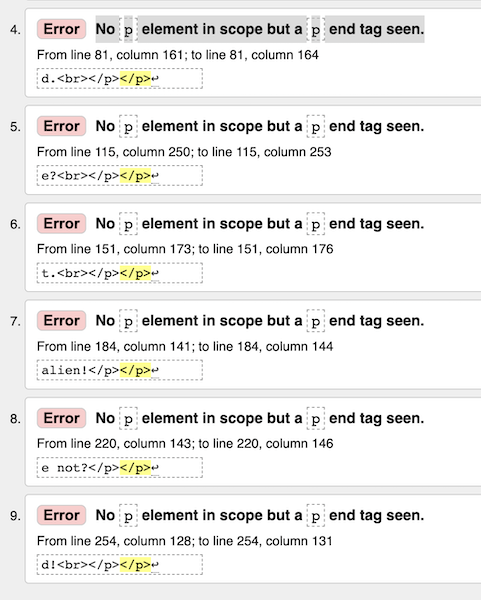
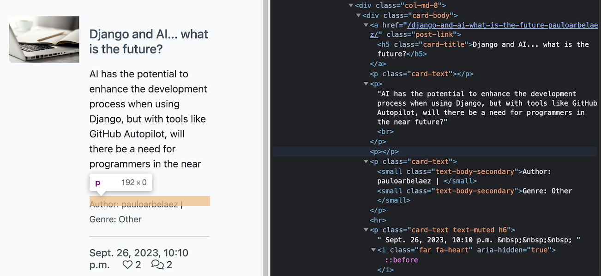

# The WC -The Wrinters Club- TESTING

## TABLE OF CONTENTS

* [AUTOMATED TESTING](#automated-testing)
    * [W3C Validator](#w3c-validator)

## AUTOMATED TESTING

### W3C Validator

[W3C](https://validator.w3.org/) was used to validate the HTML of the website. It was also used to validate the CSS.

6 error were found in the index.html, but all of them have the same description: "No p element in scope but a p end tag seen."

The problem is derived from Summernote, as it renders the text into HTML, and it doesn't add the p tags correctly . This is not a problem, as the text is rendered correctly.

