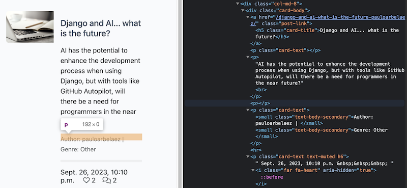
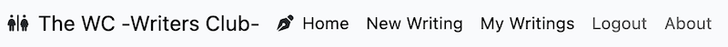
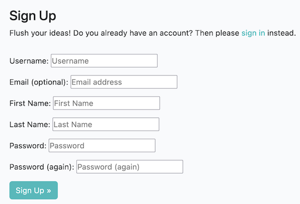

# The WC -The Wrinters Club- TESTING

## TABLE OF CONTENTS

* [AUTOMATED TESTING](#automated-testing)
    * [W3C Validator](#w3c-validator)
    * [JSHINT](#jshint)
    * [PEP8](#pep8)
    * [Jigsaw](#jigsaw)
    * [Lighthouse](#lighthouse)
        * [Index](#index)
        * [Writing Details](#writing-details)

## AUTOMATED TESTING

### W3C Validator

[W3C](https://validator.w3.org/) was used to validate the HTML of the website. It was also used to validate the CSS.

6 error were found in the index.html, but all of them have the same description: "No p element in scope but a p end tag seen."

The problem is derived from Summernote, as it renders the text into HTML, and it doesn't add the p tags correctly . This is not a problem, as the text is rendered correctly.

**NOTE:** The same problem happens in the other pages.

### JSHINT

No specific JavaScript code was used in the project. All the JavaScript code was provided by the libraries and frameworks used.

### PEP8

The code was validated using [PEP8](https://pep8ci.herokuapp.com/#). The only errors found were related to the length of the lines, that being such an extensive project, it was impossible to keep the lines under 79 characters.

### Jigsaw

[Jigsaw](https://jigsaw.w3.org/css-validator/) was used to validate the CSS code.

### Lighthouse

[Lighthouse](https://developers.google.com/web/tools/lighthouse) was used to test the performance of the website.

#### Index

The performance of the website is good, but it could be improved by reducing the size of the images. But, as for now there is no control on image sizes, and they will be uploaded by the users, it was simulated using the highest resolution images available and given by the images generator.

The score of best practices is derived from the Heroku deployment system and the lack of security on it native implementation. This is not a problem of the website, but of the deployment system.

Mobile devices:

Desktop devices:

#### Writing Details

For the writing details page, the results are better, as not so many images are used.

Mobile devices:

Desktop devices:

## MANUAL TESTING

In this section is included not only the functional parts of the webpage, but also the design and responsiveness of it. The testing includes the requirements of the project, and the additional features added comming from the user stories included in the [project](https://github.com/users/Parbelaez/projects/1).

### Navbar

| Goals | How are they achieved? | Image |
| :--- | :--- | :--- |
| The navbar is responsive, and it changes to a burger menu when the screen is getting into the mobile domain| The navbar is built using Bootstrap, and it is responsive by default. |  |
| --- | --- | --- |
| The Navbar gives the option of loging in and sign up for non-logged users, and log out for logged users | Using Django's conditional statements -derived from Python- |  |
| --- | --- | --- |
| The Navbar gives the option of logout and give all access to logged users | Using Django's conditional statements -derived from Python- |  |

### Notifications and Messages

| Goals | How are they achieved? | Image |
| :--- | :--- | :--- |
| The notifications and messages are displayed properly after the user has performed actions like: loging in, loging out, comment a writing, among other | Mapping the messages and displaying them using Bootstrap's notification banners |  |
| --- | --- | --- |
| The notifications and messages are displayed for 3 seconds | Inserting a JS script in the base.html file |  |

### Account Management

| Goals | How are they achieved? | Image |
| :--- | :--- | :--- |
| The user can create an account | Using Django's built-in authentication system + Allauth |  |
| --- | --- | --- |
| The user can log in | Using Django's built-in authentication system + Allauth |  |
| --- | --- | --- |
| The user can log out | Using Django's built-in authentication system + Allauth |  |

### Writing Management (CRUD Functionality)

| Goals | How are they achieved? | Image |
| :--- | :--- | :--- |
| The user can create a writing | Using forms and Summernote, the user is having a full text editor experience |  |
| --- | --- | --- |
| The user can edit a writing | Using forms and Summernote, the user is having a full text editor experience |  |
| --- | --- | --- |
| The user can delete a writing | Using Django's DeleteView |  |

### Comment Management

| Goals | How are they achieved? | Image |
| :--- | :--- | :--- |
| The user can comment a writing | Using forms and Summernote, the user is having a full text editor experience |  |
| --- | --- | --- |
| The writing author can administer the comments | Implementing functionalities in the models and views to be able to approve, delete, and select the comments according to the author's needs |  |

### Full Testing

Full testing was performed on the following devices:

* Laptop:
  * Macbook Pro 2022 16 inch screen
* Mobile Devices:
  * iPhone 12 pro.
  * iPhone 6s.
  * iPad Air 4.

Each device tested the site using the following browsers:

* Google Chrome
* Safari
* Firefox
* Edge

Additional testing was taken by friends and family on a variety of devices and screen sizes.  
